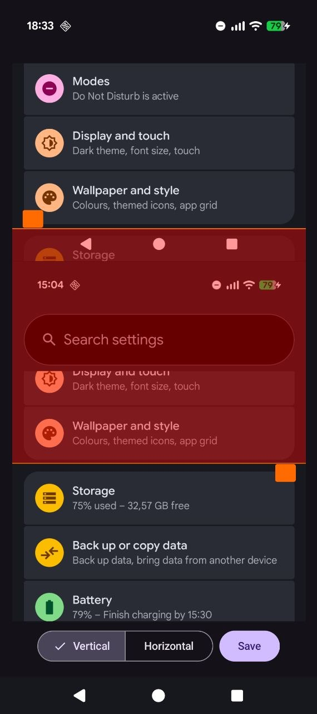

# Stitch Screenshots [](https://github.com/nikitabobko/stitch-screenshots-android/actions/workflows/build.yml)

Simple Android app for stitching multiple screenshots into a single long screenshot.

## Installation

- Download the APK file directly from [GitHub releases](https://github.com/nikitabobko/stitch-screenshots-android/releases) (no automatic updates)
- [Install via Obtainium](https://apps.obtainium.imranr.dev/redirect?r=obtainium://add/https://github.com/nikitabobko/stitch-screenshots-android) (Obtainium keeps track of updates)

## Screenshots



## Building

```shell
echo 'sdk.dir=/Users/bobko/Library/Android/sdk' >> local.properties

# Debug
./gradlew assembleDebug # ./build/outputs/apk/debug/StitchScreenshots-debug.apk

# Release
keytool -genkey -v -keystore ./release.jks -keyalg RSA -validity 36500 -storepass ******
echo 'storePassword=******' >> ./local.properties
./build-release.sh # ./stitch-screenshots-android-v*.apk
```

## License

MIT
